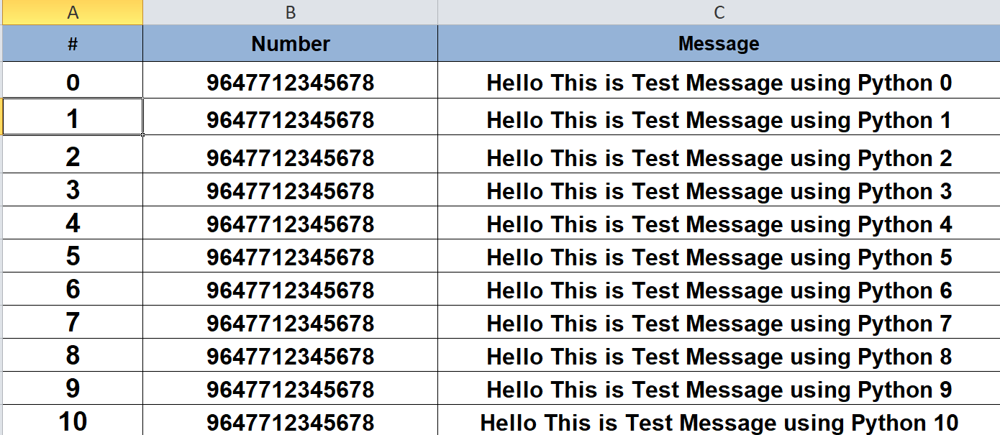

# Python Project Setup Guide

## Setup Virtual Environment

### Windows:

```sh
python -m venv env
```

### Linux:

```sh
python3 -m venv env
```

## Activate Virtual Environment

### Windows:

```sh
env\Scripts\activate
```

### Linux:

```sh
source env/bin/activate
```

## Install Requirements

```sh
pip install -r requirements.txt
```

## Run Python File

```sh
python main.py
```

### Steps

    - Choose the xlsx file and Click Send Messages
    - The code will open the Browser (Chrome Driver)
    - Please scan the QR code to log in to WhatsApp Web.
    - After login into WhatsApp Click OK when you are logged in.

### xlsx File example


